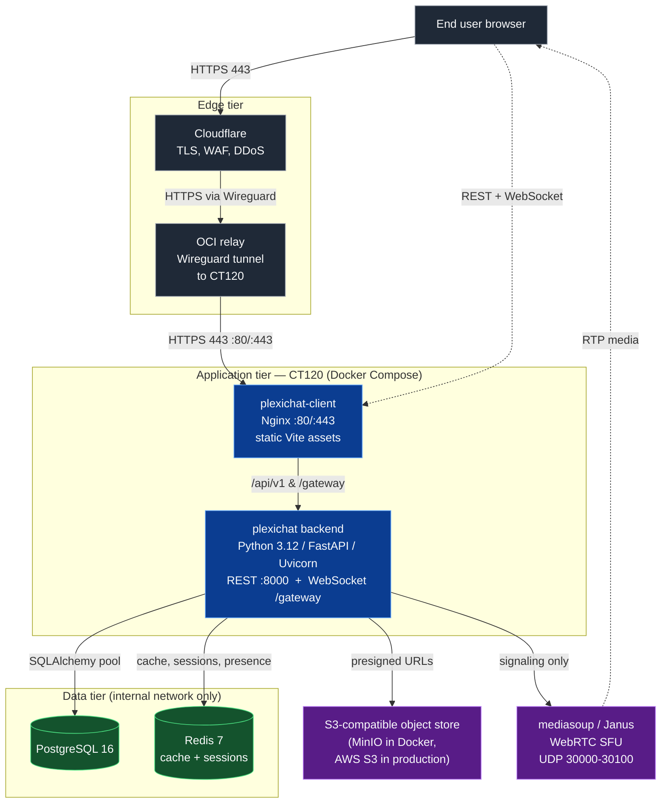

# Deployment Overview

Plexichat is a distributed messaging platform that can be deployed in various environments from development to production. This guide covers the complete deployment process.

## Deployment Options

Plexichat supports multiple deployment strategies:
- **Development**: Local setup with SQLite database
- **Production**: PostgreSQL with Redis caching and external storage
- **Containerized**: Official Docker Compose stack via standalone deploy scripts (Primary)
- **Manual/Development**: Direct installation via Git clone
- **Cloud**: Various cloud provider options

## Architecture

The runtime topology follows three concentric tiers. End-user traffic is terminated at the edge, tunneled to the application container, and dispatched across the data tier by the FastAPI backend.



## Key Components

1. **Backend Server** (`plexichat`): Python 3.11+ / FastAPI application providing REST API and WebSocket gateway
2. **Client Interface** (`plexichat-client`): Modern Vite web application served via Nginx
3. **Shared Utilities** (`common_utils`): Internal helpers bundled at `plexichat/src/utils/common_utils/`, used only by the server. The web client lives in a separate JavaScript repository and does not share this Python package.
4. **Database**: PostgreSQL (recommended) or SQLite (development only)
5. **Cache**: Redis (recommended for production)
6. **Storage**: Local filesystem or S3-compatible (MinIO, AWS S3, etc.) for media attachments
7. **WebRTC SFU** (`mediasoup` default, `Janus` alternative): Optional signaling peer for voice/video; media plane on UDP 30000-30100
8. **Reverse proxy / TLS** (`plexichat-client` container Nginx): TLS termination and proxy of `/api/v1` and `/gateway` to the backend

## Prerequisites

Before deploying Plexichat, ensure you have:
- Git (for cloning repositories)
- Python **3.11+** (for both server and client; 3.10 will not work)
- pip (Python package manager)
- Node.js 16+ (only needed for client testing with Playwright)
- PostgreSQL 12+ (for production deployments)
- Redis 6+ (recommended for production)

## Primary Deployment Flow (Zero-Clone)

The recommended, officially supported way to deploy Plexichat is using the standalone deploy scripts. This completely automates credential generation, configuration, and image downloading without requiring a Git clone.

**Linux / macOS:**
```bash
curl -sSL https://plexichat.com/deploy.sh | bash
```

**Windows (PowerShell):**
```powershell
irm https://plexichat.com/deploy.ps1 | iex
```

## Manual Deployment Flow (Development)

1. Clone the repositories from GitLab
2. Install dependencies for both server and client
3. Configure environment variables and configuration files
4. Initialize the database (runs automatically on first startup)
5. Start the services
6. Verify deployment through health check endpoints

For system requirements, see [Requirements](requirements.md). For configuration, see the [Configuration Overview](../configuration.md) and the per-subsystem config guides linked from [Deployment](../deployment.md).